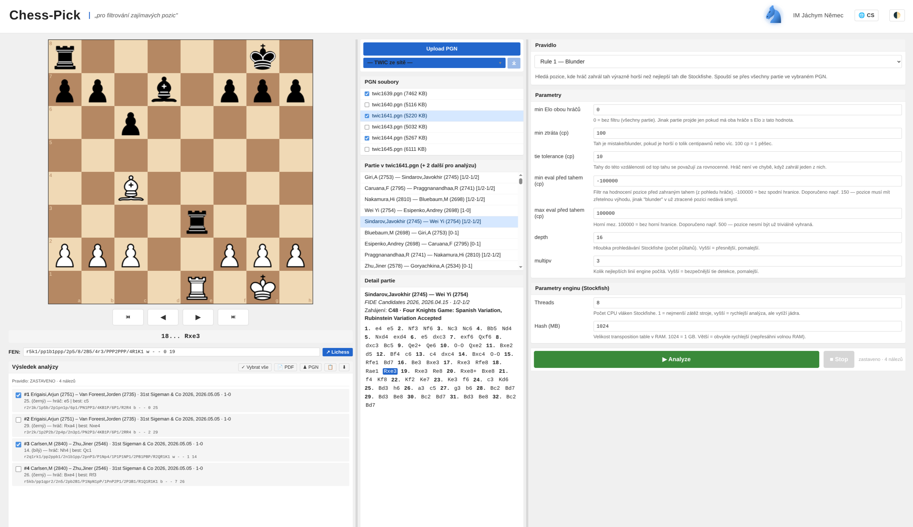
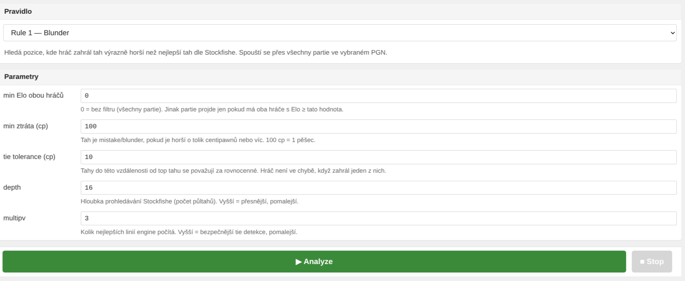
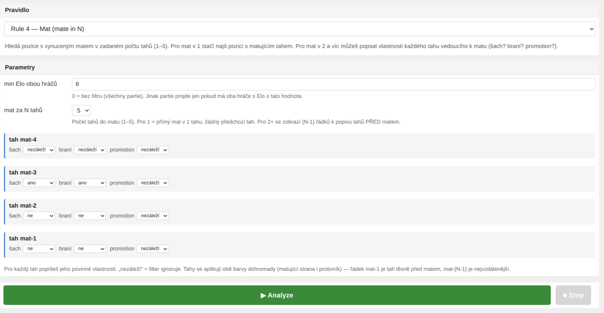
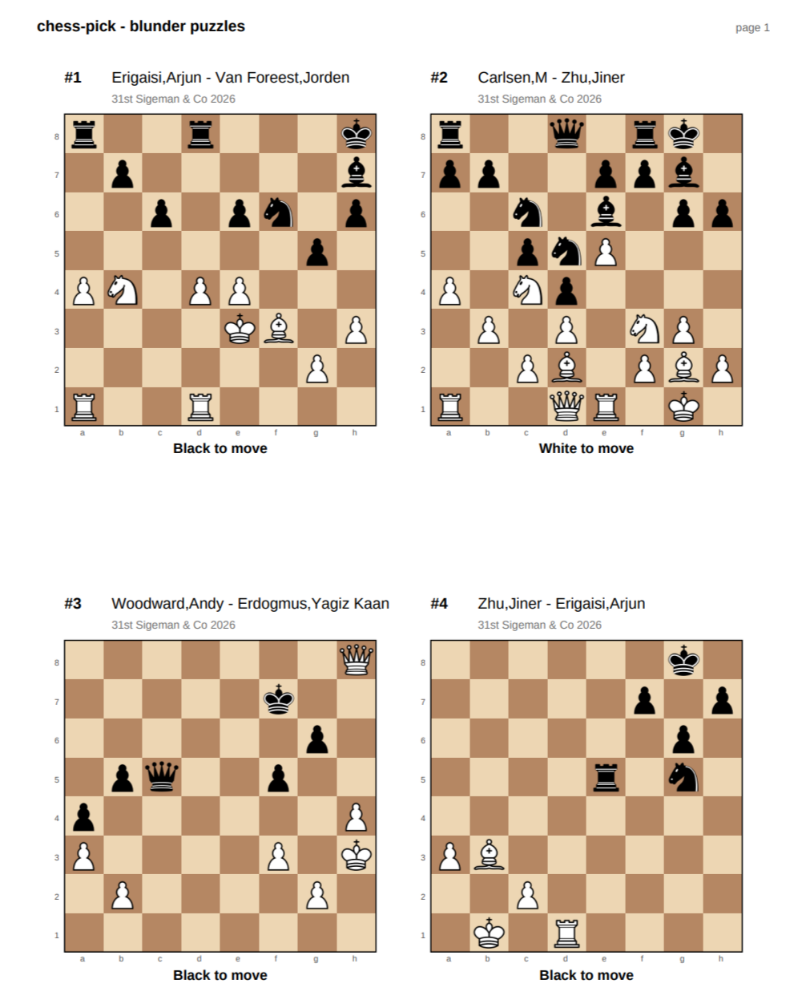
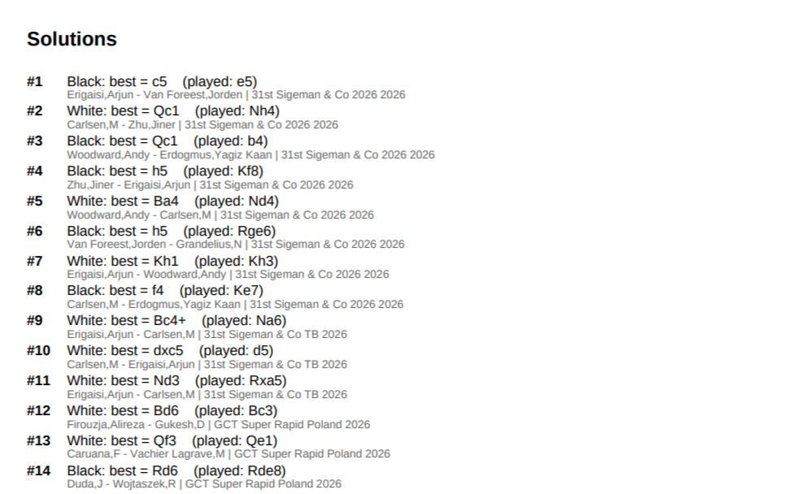

# chess-pick

Filtruje zajímavé pozice z PGN partií pro šachový trénink. Aplikace prochází
PGN soubory, hodnotí pozice Stockfishem a podle zvolených pravidel vybírá
pozice, které si pak řešíš sám.



## Co aplikace umí

- 4 hledací pravidla — **Blunder**, **Zwischenzug**, **Struktura/rozestavění**, **Mat (mate in N)**
- Webové UI s šachovnicí, navigací po tazích, PGN browserem, výběrem pravidel
  a streamovanou analýzou (lze kdykoli zastavit)
- Cache evaluací (`eval_cache.db`) — po prvním běhu jsou opakované analýzy
  stejné pozice instantní
- **PDF export** — 4 diagramy na A4 stránku + sekce s řešeními (pro Blunder,
  Zwischenzug a Mat)
- Otevření aktuální pozice rovnou v Lichess analýze (engine + database)
- Import vlastní partie do Lichess studie přes API
- Light / dark theme

## Požadavky

- **Python 3.12+** — [python.org/downloads](https://www.python.org/downloads/)
  - ⚠️ Při instalaci na Windows zatrhni **„Add Python to PATH"**
- **Git** — [git-scm.com/download/win](https://git-scm.com/download/win)
- **Stockfish** (UCI engine) — viz [Stockfish](#stockfish) níže
- Libovolné **PGN soubory** s partiemi — viz [PGN soubory](#pgn-soubory) níže

## Instalace na Windows

Otevři **PowerShell** (Windows Terminal). Stačí copy-paste:

```powershell
# 1. naklonuj repo
git clone https://github.com/bardolf/chess-pick.git
cd chess-pick

# 2. vytvoř virtualenv
python -m venv .venv

# 3. nainstaluj závislosti
.venv\Scripts\pip install -r requirements-dev.txt
```

### Stockfish

Stáhni `stockfish-windows-x86-64-avx2.zip` z [stockfishchess.org/download](https://stockfishchess.org/download/),
rozbal a buď:

- **A) (Doporučeno)** přejmenuj `.exe` na `stockfish.exe` a hoď ho přímo do kořene
  projektu `chess-pick\` vedle `main.py`. Aplikace ho najde sama.

- **B)** Pokud chceš nechat exe jinde, nastav env proměnnou na **skutečnou cestu
  k tvému exe** (ne tento příklad doslova!):

  ```powershell
  # nahraď path skutečnou cestou na tvém disku
  $env:STOCKFISH_PATH = "D:\engines\stockfish-windows-x86-64-avx2.exe"
  ```

  `$env:` v PowerShellu platí **jen v aktuálním okně**. Pro trvalé nastavení
  použij *System Properties → Environment Variables*.

### PGN soubory

Aplikace hledá `*.pgn` v adresáři `twic/`. Vytvoř ho a nasyp tam PGN:

```powershell
mkdir twic
```

Zdroje partií:

- [TWIC archive](https://theweekinchess.com/twic) — týdenní balíky elitních turnajů (ZIP)
- [Lichess Database](https://database.lichess.org/) — měsíční dumpy (varování: gigabajty)
- Lichess studie → tlačítko „Download as PGN"
- Vlastní hra (export z chess.com / Lichess)

Místo ručního kopírování PGN do `twic/` lze taky použít **„Upload PGN"**
v UI (prostřední sloupec nahoře) — soubor se uloží automaticky.

## Spuštění

Nejjednodušší — dvojklik na **`start.bat`** v kořeni projektu (nebo
`./start.sh` na Linuxu/macOS). Otevře se konzole s logem.

Manuálně:

```powershell
.venv\Scripts\uvicorn web.app:app --host 127.0.0.1 --port 8000
```

Otevři v prohlížeči **[http://127.0.0.1:8000](http://127.0.0.1:8000)**.

Ctrl+C v terminálu server zastaví.

---

## Práce s aplikací

### Layout

3 sloupce (modré dělítko mezi nimi je tahatelné):

- **Vlevo** — šachovnice, navigace po tazích (⏮ ◀ ▶ ⏭), FEN aktuální pozice,
  odkaz na Lichess analýzu, výstup analýzy + PDF export
- **Uprostřed** — seznam PGN souborů z `twic/`, partie v souboru, detail partie
- **Vpravo** — výběr pravidla, parametry pravidla, ▶ Analyze / ■ Stop

### Pravidla



#### Rule 1 — Blunder / Mistake

Pozice, kde hráč zahrál tah ≥ `min_loss_cp` centipawnů horší než nejlepší tah engine.
Klasické tréninkové „najdi lepší tah" pozice.

#### Rule 2 — Zwischenzug (Mezitah)

Pozice, kde po soupeřově braní engine doporučuje **non-recapture šach nebo
braní jiné figury** (mezitah). Tréninkový set bez ohledu na to, co hráč
skutečně zahrál.

Parametry:
- `min_gain_cp` — minimální převaha mezitahu nad rekapitulací (pro ne-šach)
- `require_check_or_capture` — mezitah musí být šach nebo braní
- `min_player_cp` — hráč nesmí být po mezitahu prohraný o víc než tolik

#### Rule 3 — Struktura / rozestavění

Filtr pozic podle daného vzoru figurek (např. izolovaný pěšec na d4,
věž na 7. řadě, atp.). Vzor se zadává jako FEN-like řetězec.

#### Rule 4 — Mat (mate in N)

Najde forsírované maty délky N. UI umožňuje specifikovat každý jednotlivý
tah mata zvlášť — typ (šach / braní / promotion) a hodnotu (ano / ne / nezáleží).



### Výsledek analýzy

Po stisku ▶ Analyze běží stream pozic v levém sloupci. ■ Stop přeruší.
Kliknutí na výsledek nahraje pozici na šachovnici nahoře.

### PDF export

V hlavičce výstupu zmáčkni 📄 **PDF**. Vygeneruje PDF s 4 diagramy na A4
stránku + sekce *Solutions* na konci. K dispozici pro Rule 1, 2, 4.



Na konci PDF jsou všechna řešení pohromadě (nejlepší tah engine vs. tah skutečně
zahraný, podpis partie):



### Theme

🌓 v pravém horním rohu hlavičky přepíná **dark / light**. Volba se ukládá.

---

## Tipy

- **■ Stop** přeruší probíhající analýzu (stream přes NDJSON)
- Parametry pravidel se per-rule ukládají do `localStorage`
- Cache (`eval_cache.db`) výrazně zrychluje opakované běhy nad stejným PGN
- Reset celé cache:
  ```powershell
  Remove-Item eval_cache.db
  ```
- Reset jen „viděných" pozic (engine cache zůstane):
  ```powershell
  sqlite3 eval_cache.db "DELETE FROM seen_candidates;"
  ```
- Klikni na **modrého jezdce** v hlavičce ¯\\\_(ツ)\_/¯

---

## Instalace na Linux / macOS

Pro úplnost:

```bash
git clone https://github.com/bardolf/chess-pick.git
cd chess-pick
python -m venv .venv
.venv/bin/pip install -r requirements-dev.txt

# Stockfish (Debian/Ubuntu):
sudo apt install stockfish
export STOCKFISH_PATH=/usr/games/stockfish

./start.sh                 # nebo: .venv/bin/uvicorn web.app:app --host 127.0.0.1 --port 8000
```

## Vývojové info

CLI varianta (batch běh bez webu):

```bash
.venv/bin/python main.py            # Linux/macOS
.venv\Scripts\python main.py        # Windows
```

Konfigurace v `main.py`:
- `SEARCH_MODE` — `"blunder"` / `"zwischenzug"` / `"zwischenzug_available"`
- `TEST_MODE = True` — vypne Elo gate, vhodné pro curated testovací PGN
- `STOCKFISH_THREADS`, `STOCKFISH_HASH_MB`

Testy:

```bash
.venv/bin/pytest -v
```

Struktura projektu:

```
chess-pick/
├── main.py             # CLI entry point + konfigurace
├── filters.py          # pravidla (Blunder, Zwischenzug, PawnStructure, Mate, ...)
├── evaluate.py         # Stockfish wrapper + STOCKFISH_PATH resolution
├── cache.py            # SQLite cache + SeenStore + ProcessedGames
├── openings.py         # Lichess opening klasifikace (ECO TSV)
├── web/
│   ├── app.py          # FastAPI server
│   ├── static/         # CSS, JS, jezdec :)
│   └── templates/      # HTML
├── twic/               # PGN partie (gitignore — uživatelské)
├── data/eco/           # ECO TSV (importováno z Lichess)
├── tests/              # pytest suite
└── doc/img/            # README screenshoty
```
